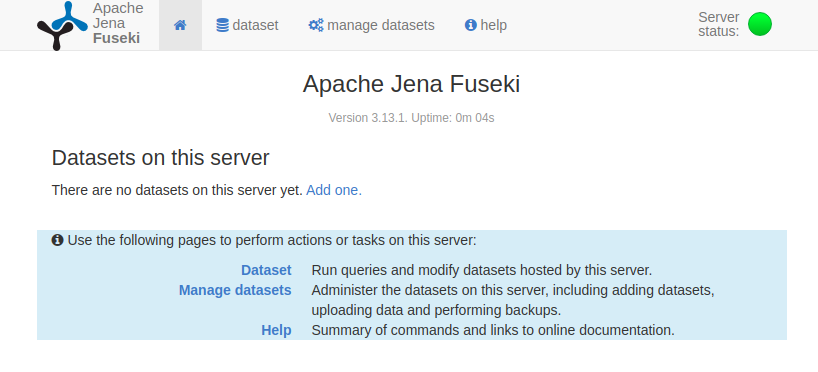
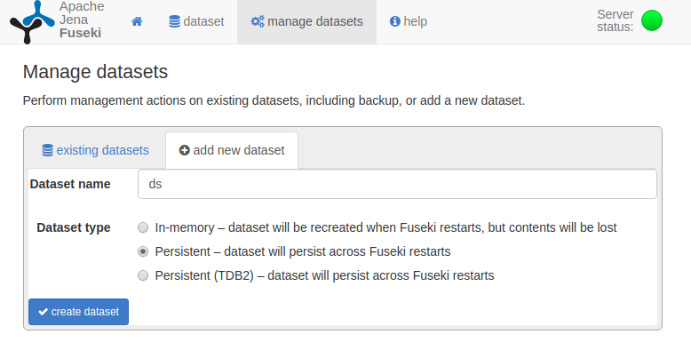
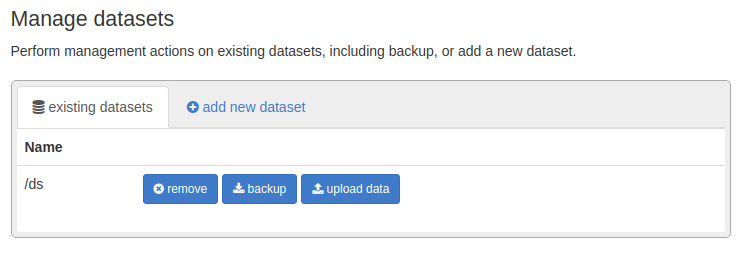
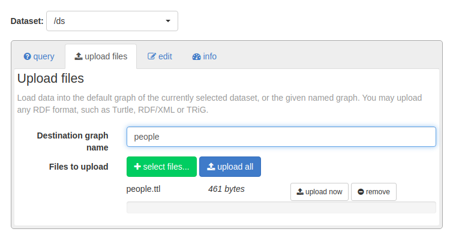
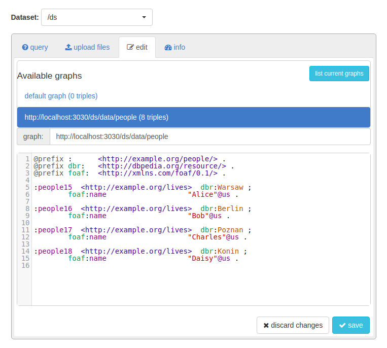

# SPARQL Examples
### Intro
This project uses Scala and Apache Jena in order to run SPARQL queries.
Queries can either be run using Local Apache Jena Fuseki instance or using external DBpedia SPARQL endpoint.

For demonstration purposes, it is better to use a local server instance for running federated queries.
When running queries through DBpedia endpoint you can't use federated queries.

### Running application
In directory `utils` they are two scripts. First `get_jena.sh` is used to download and unpack the server in `utils` directory.
The second `start_fuseki.sh` is used to run the Fuseki server locally. 
Note that you need to `cd` to directory `<YOUR_PROJECT_DIR>/utils` when running any of these scripts.

Then in the root project folder, you can run `sbt run` to start application.
The first run can take some time because `sbt` needs to pull all dependencies.
If prompted to select the main class, select the option that says `GuiExamples`.

### Fuseki Setup
After running script `start_fuseki.sh` you need to populate RDF store with data. 
Sample data used in this project is in file `data/people.ttl`. This section provides instruction on populating Fuseki with data.

When your Fuseki server is running, open browser and go to site: `http://localhost:3030/`. You should see following site:

There is no dataset, so click on `Add one` to add it. 

Name your dataset as `ds`. You can also check the persistent option for keeping the data between restarts.

Click on `upload data` button to add out sample Turtle file.

Click on `select files...` and select the example file included in this project.
Click on `upload now` to index the data in Fuseki.
Remember to name destination graph as `people`.

To check your data and modify in on site go to `edit` page and open `http://localhost:3030/ds/data/people` graph. You can also click on `list current graphs` for list view of all available graphs.

### Example queries
When starting GUI project with sbt, there is already one query loaded so you can run it. 
This query has no need for populated Fuseki data store. 
Fuseki must be running in background in order to execute this query. This limitation is the clue of federated queries: most SPARQL providers (including DBpeida) don't allow execution of federated queries on their side, that's why the query is executing locally on our Fuseki server.

In folder `qureies` you have two example queries. `queries/query_1.sparql` is the default one, loaded on startup. `queries/query_2.sparql` is example that uses sample data provided with this project.